# Evidências — Fase 1 (Construindo o Projeto)

## Rede e ingresso no domínio

**1. Cliente pega IP do Domain Controller via DHCP Relay,**
O WS-RH01 recebeu `192.168.20.100`, gateway `192.168.20.1` e **Servidor DHCP `192.168.10.10`** (o DC), com DNS `192.168.10.10` e sufixo `nexora.local`. Prova que firewall + DHCP + relay funcionam juntos.

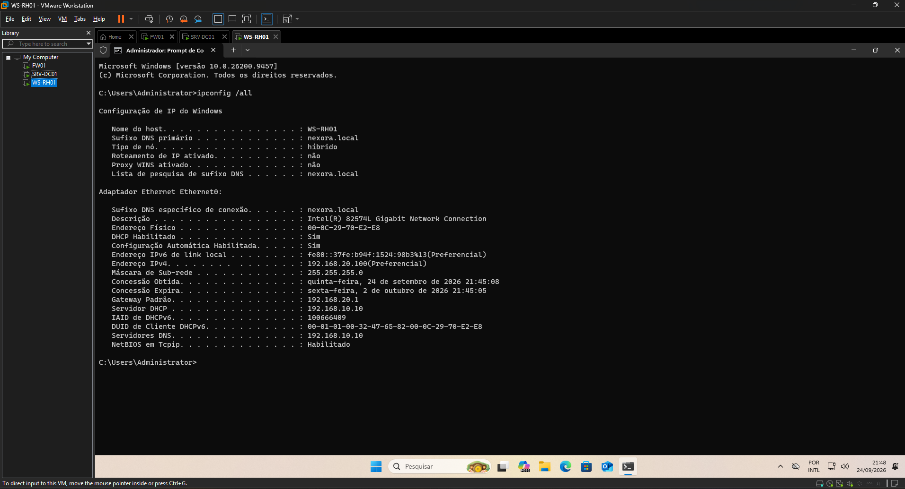

**2. Estação autenticada no domínio**
`whoami` no WS-RH01 retorna `nexora\administrator` — a máquina está no domínio.

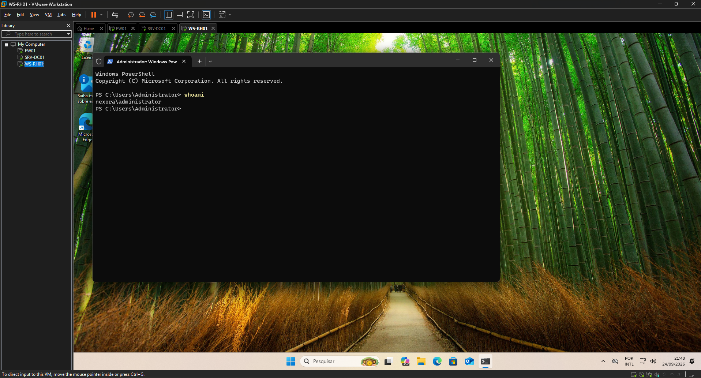

**3. Tela de login com conta de domínio**

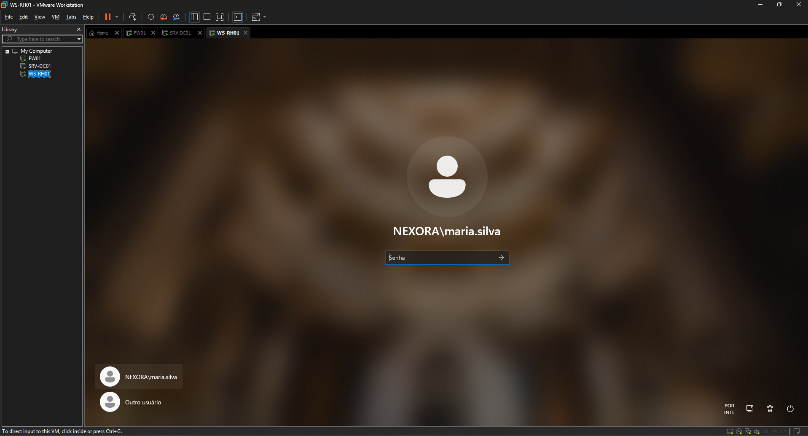

**4. Usuário de domínio logado na estação**
Configurações do Windows mostrando `maria.silva@nexora.local` conectada.

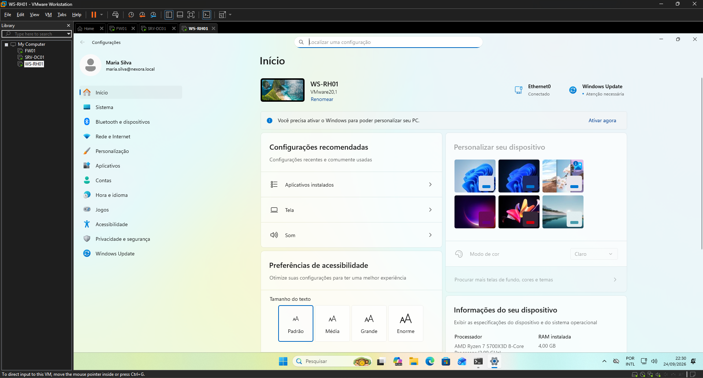

## Active Directory — Estrutura

**5. Árvore de OUs (ADUC)**
`nexora.local → Nexora → Admins, Computadores (Servidores/Workstations), ContasServico, Grupos, Usuarios (Comercial/Diretoria/Financeiro/RH/TI)`.

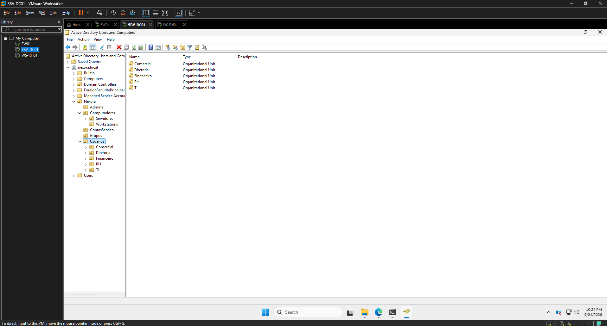

**6. Usuários criados por script**
`Get-ADUser` listando os usuários da OU Usuarios: Maria Silva, Joao Souza, Ana Costa, Carlos Lima, Paula Rocha.

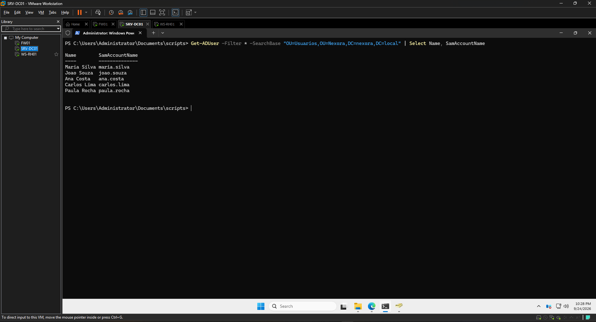

**7. Usuário pertence ao grupo do departamento**
`whoami /groups` da maria.silva mostrando **NEXORA\GRP-RH** — base do RBAC.

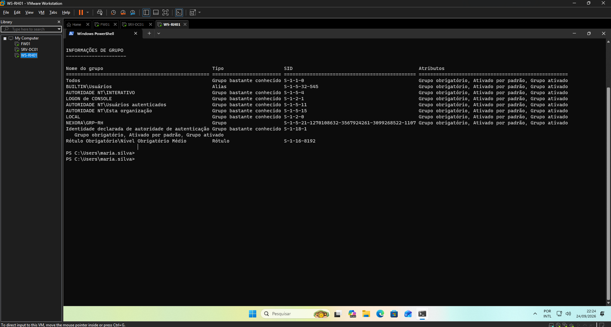

**8. Computador movido para a OU correta**
WS-RH01 dentro de `OU=Workstations` (para receber GPOs na Fase 2).

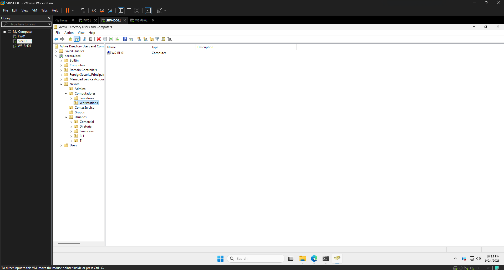

## Servidor de arquivos e RBAC

> **Observação: Boas Práticas** - Porque não hospedar o File Server no Domain Controller.
> 
> Neste Laboratório, por limitações de recursos (RAM/CPU do Host), O compartilhamento de arquivos foi colocado no próprio SRV-DC01. Isso é só aceitável em Lab, em produção é uma má prática. 

**9. Compartilhamentos criados (Server Manager)**
7 shares: NETLOGON, SYSVOL, RH, Comercial, Diretoria, Financeiro, TI — cada um em `C:\Compartilhado\...`.

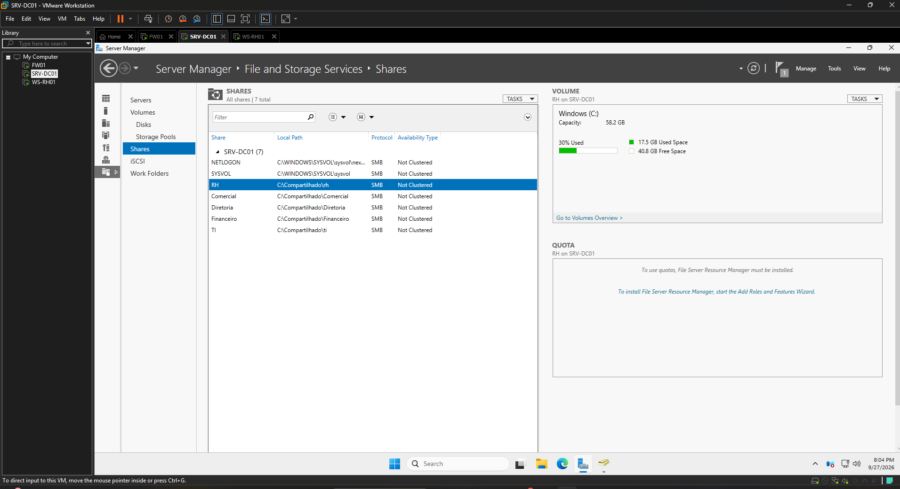

**10. Acesso PERMITIDO à própria pasta**
maria.silva (RH) abre `\\srv-dc01\rh` normalmente.

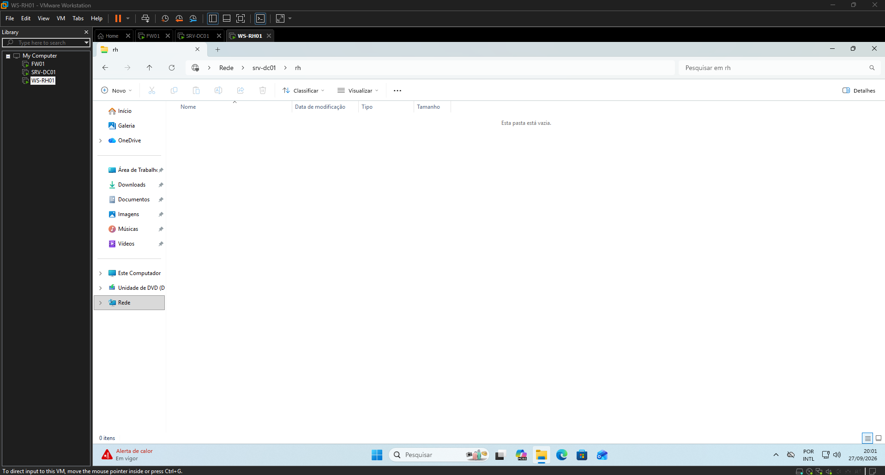

**11. Acesso NEGADO à pasta de outro setor (a prova de ouro)**
A mesma maria.silva é **bloqueada** em `\\srv-dc01\Financeiro`: *"Você não tem permissão para acessar"*. A segregação por grupo funciona.

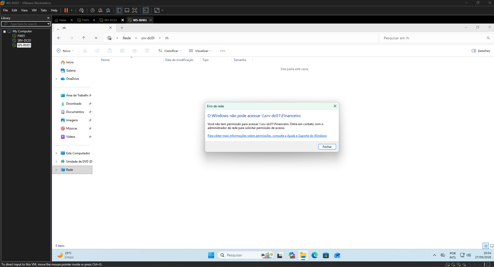

---

