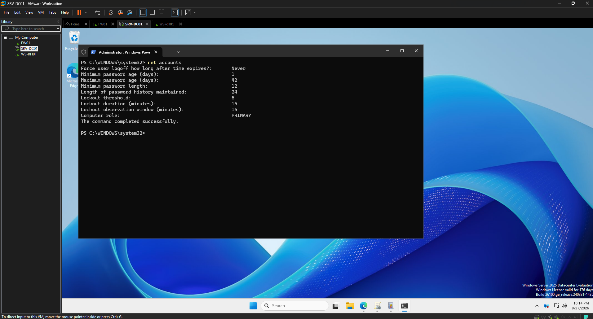
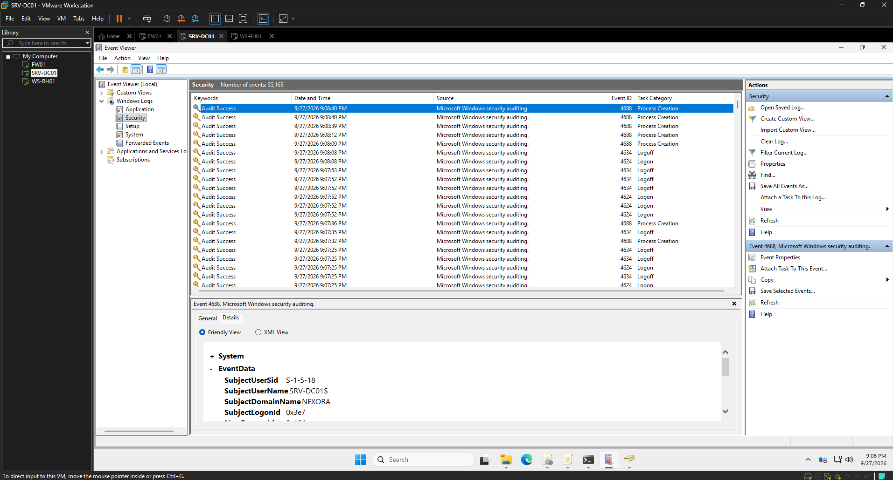
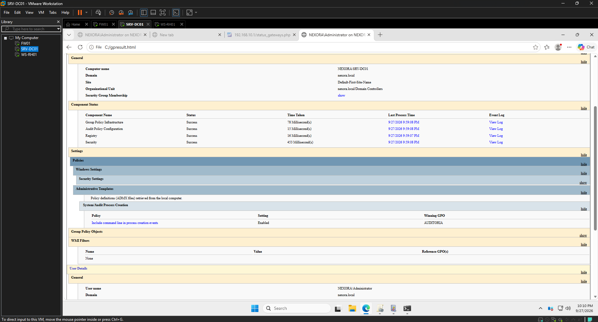
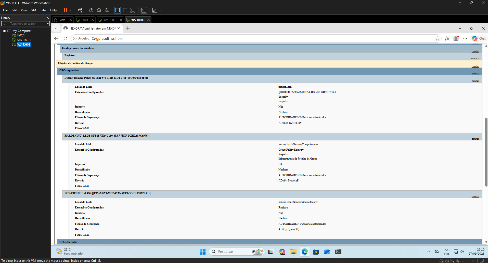
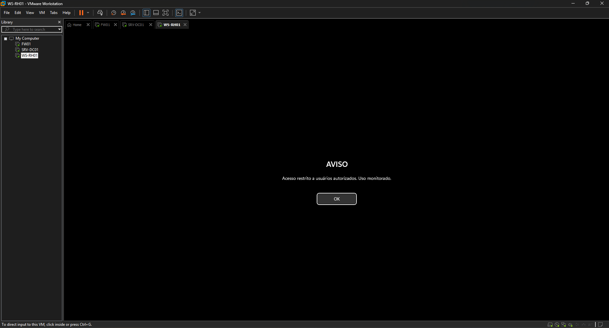
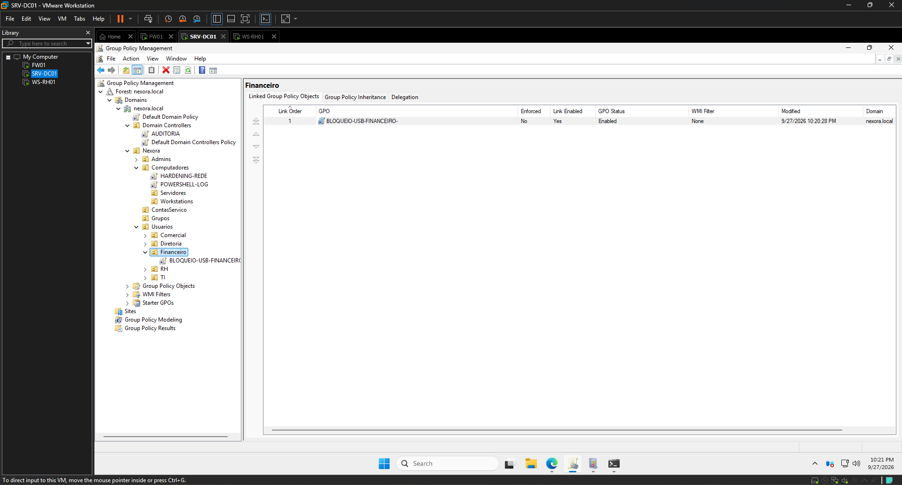
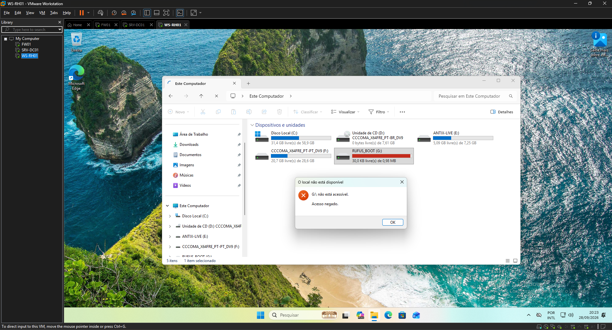
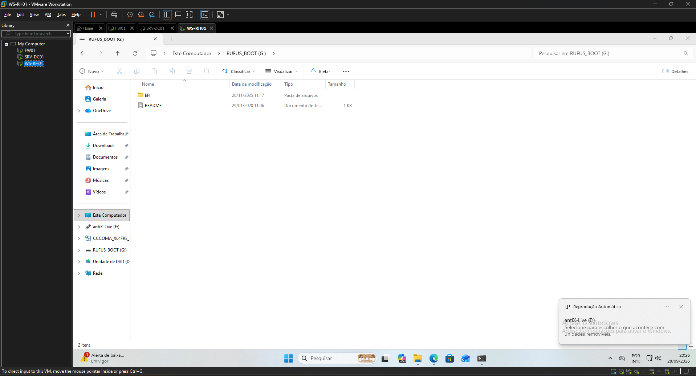

# Evidências — Fase 2 (Hardening + GPOs)

## Política de conta (Default Domain Policy)

**1. Política de senha e bloqueio**
`net accounts` no DC: comprimento mínimo **12**, histórico **24**, bloqueio após **5** tentativas, duração **15 min**. Reaplicada após o reset com `dcgpofix`.

## Auditoria (GPO AUDITORIA)

**2. Eventos de auditoria fluindo**
Security log do DC com **4688 (Process Creation)**, **4624 (Logon)** e **4634 (Logoff)** — a auditoria avançada está gerando os eventos que o SIEM vai consumir na Fase 3.

**3. gpresult no DC — AUDITORIA como Winning GPO**
"Include command line in process creation events" com **Winning GPO = AUDITORIA** (não mais "Default Domain Policy").

## Hardening de rede e PowerShell (GPOs por OU)

**4. gpresult no WS-RH01 — GPOs nomeadas aplicadas por OU**
As GPOs **HARDENING-REDE** (LLMNR + SMBv1) e **POWERSHELL-LOG** aplicadas via `OU=Computadores`. Prova o escopo por OU funcionando.

## Banner de aviso legal (GPO BANNER-LEGAL)

**5. Aviso no logon**
"Acesso restrito a usuários autorizados. Uso monitorado."

## Bloqueio de USB por setor (GPO BLOQUEIO-USB-FINANCEIRO)

**6. GPO vinculada só na OU=Financeiro**
Política de bloqueio de mídia removível escopada **apenas ao Financeiro** — vinculada em `OU=Usuarios/Financeiro`.

**Usuário João Souza setor Financeiro:**

**Usuário Maria Silva setor RH:**

---

