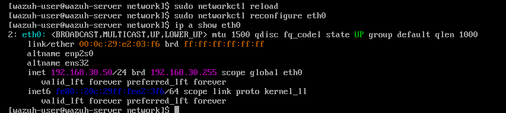
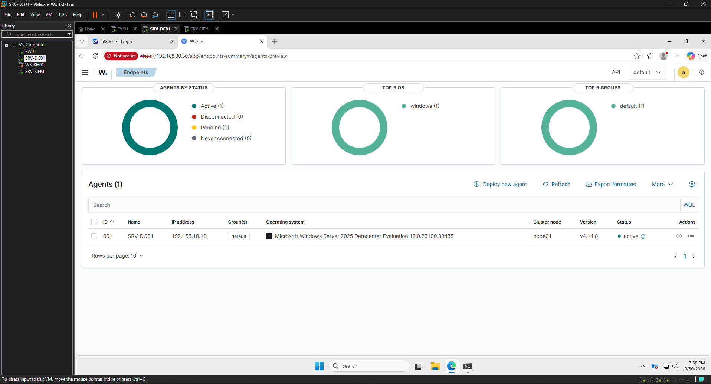
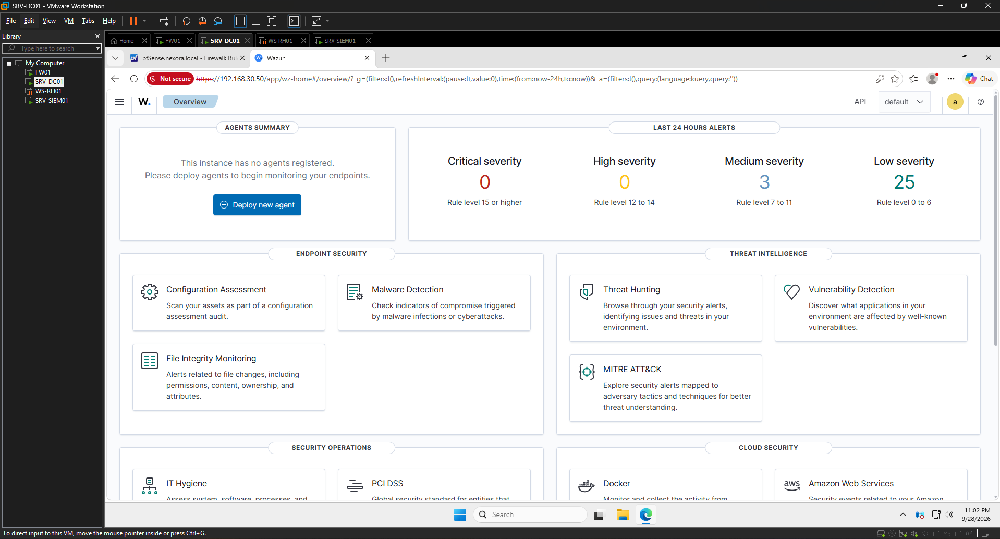
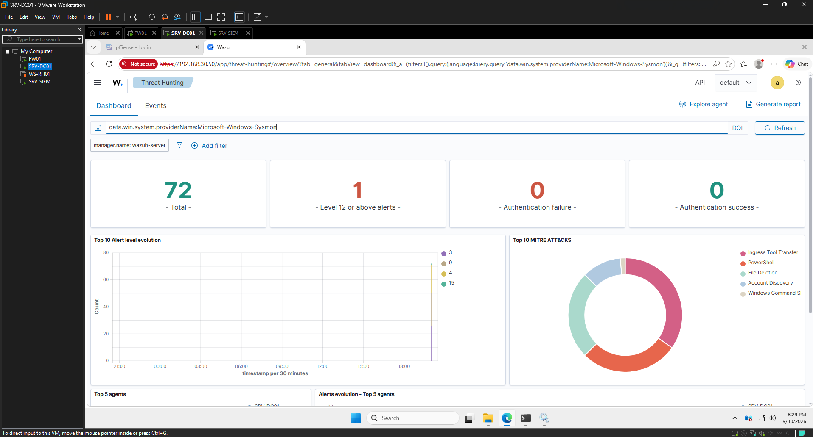

# Evidências — Fase 3 (Monitorar: Wazuh + Sysmon)

## 1. IP estático do SIEM
`SRV-SIEM01` com IP fixo **`192.168.30.50/24`** aplicado via **systemd-networkd** (não DHCP) e persistente após reboot — requisito de um SIEM (os agentes apontam para um IP fixo).

## 2. Agente Wazuh ativo no Domain Controller
Agente registrado e **`active`** no `SRV-DC01` (Windows Server 2025). É o pipeline endpoint → agente → SIEM funcionando.

## 3. Painel Wazuh operacional
Dashboard do Wazuh de pé, acessível por `https://192.168.30.50`.

## 4. Sysmon alimentando o SIEM
Após instalar o **Sysmon** (config SwiftOnSecurity) no DC e apontar o agente para o canal `Microsoft-Windows-Sysmon/Operational`: **72 eventos** coletados e **5 técnicas MITRE ATT&CK** já visíveis (Ingress Tool Transfer, PowerShell, File Deletion, Account Discovery, Windows Command Shell).

---

**Competências demonstradas:** deploy de SIEM (Wazuh), configuração de rede estática em Linux (systemd-networkd), enrollment de agente, integração do Sysmon via `localfile`/`eventchannel`, leitura de telemetria mapeada ao MITRE ATT&CK.
