# Evidências — Fase 4 (Atacar e Detectar)

## 🏆 Defesa em profundidade comprovada
Três ataques contidos por **três camadas diferentes**, os que passaram foram **detectados**:
- **Brute force** → bloqueado pela **GPO de lockout** (4740) + detectado (4625)
- **Responder (LLMNR)** → bloqueado pela **segmentação de rede** (pfSense)
- **Persistência remota** → **detectada** (NTLM/pass-the-hash, rule 92652) **e** bloqueada pelo **Windows Defender**

---

## Triagem — Falso Positivo (T1105)
Alerta nível 15 investigado até a causa raiz: `PSScriptPolicyTest` do próprio Windows = **falso positivo**.
- `01-alerta-nivel15-visao-geral.png`
- `02-fp-detalhe-eid11.png`
- `03-fp-rule92213-t1105.png`

## Ataque 1 — Reconhecimento / Nmap (T1046)
Scan do DC: portas de AD expostas (53, 88, 135/139/445, 389/636/3268, 5985) e o domínio `nexora.local` vazando via LDAP.

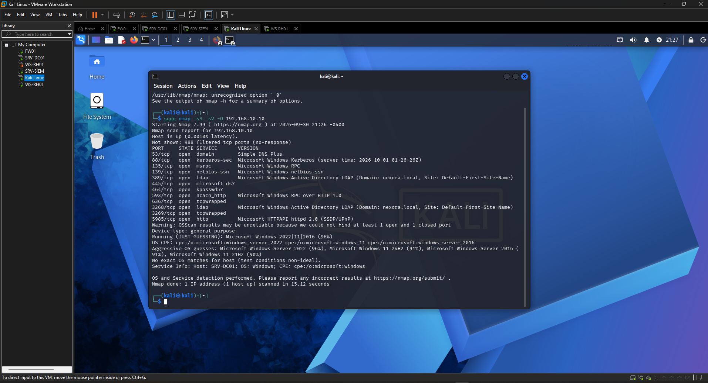

## Ataque 2 — Brute force (T1110): detectado + bloqueado
`4625` em massa (rule 60122) e a conta travada pela **GPO de lockout** → `4740` (rule 60115).

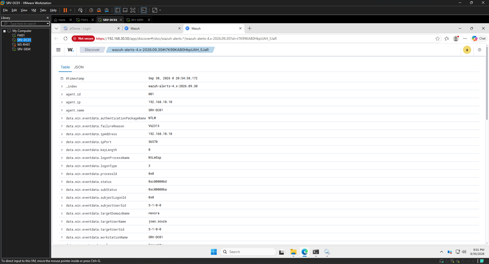

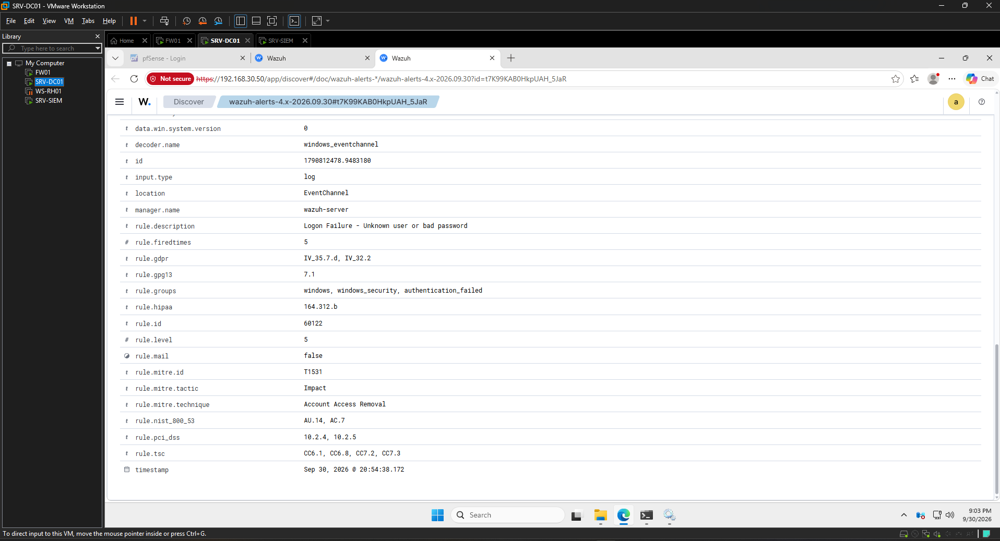

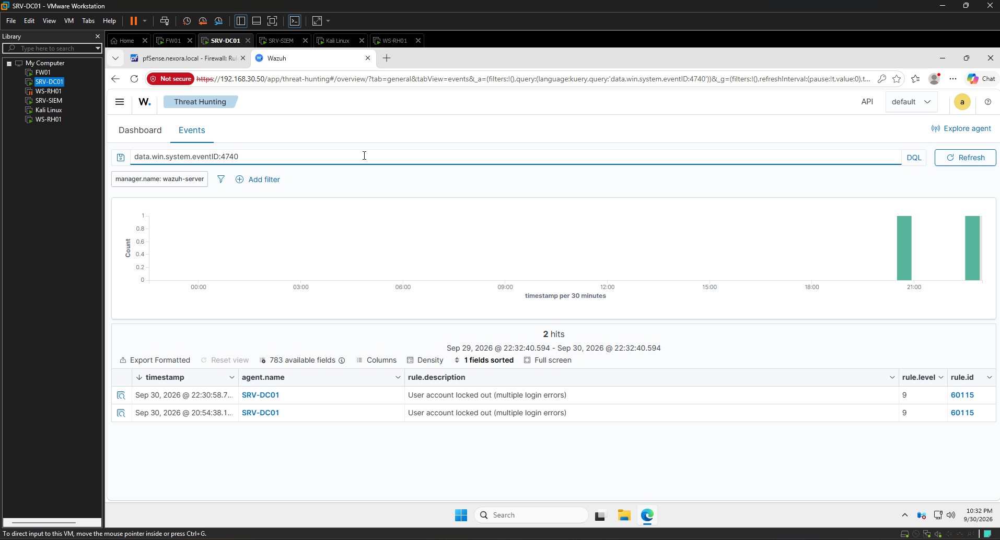

> Detectado (SIEM) **e** bloqueado (GPO) no mesmo evento detecção + prevenção juntas.

## Ataque 3 — Password spraying (T1110.003)
Mesma descrição ("Logon Failure"), **ataque diferente**: o campo `data.win.eventdata.targetUserName` mostra **usuários variados** (1 tentativa cada), evitando o lockout.

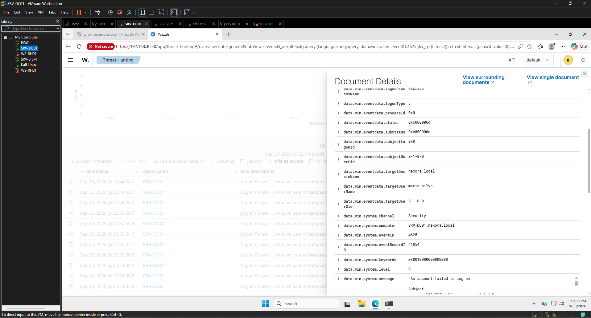

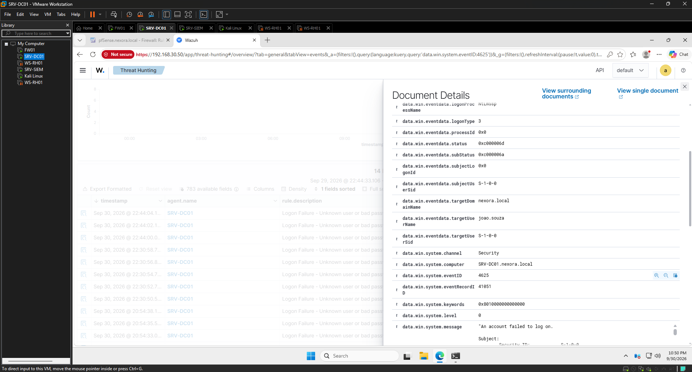

> Saber ler o `targetUserName` é o que distingue brute force (1 usuário, N senhas) de spraying (N usuários, 1 senha).

## Ataque 4 — Persistência local: admin backdoor (T1136/T1098)
Criação de usuário + elevação a Domain Admin (cenário *assumed breach*), detectados pelo SIEM.

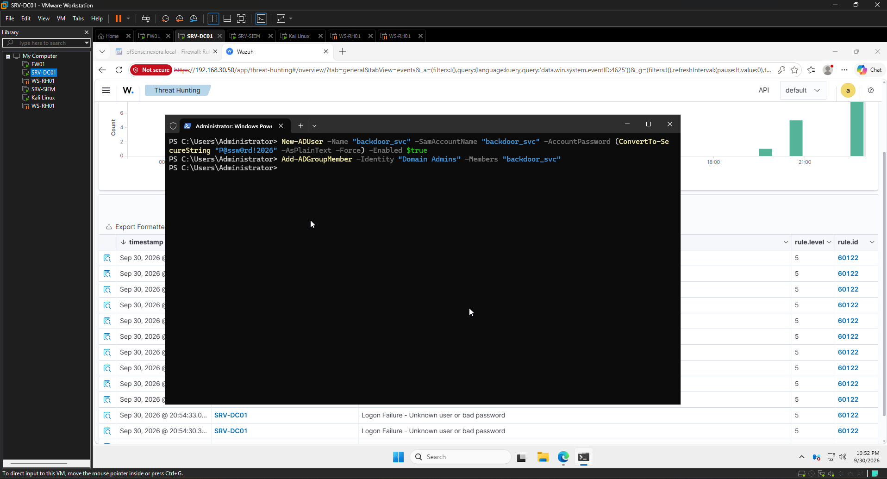

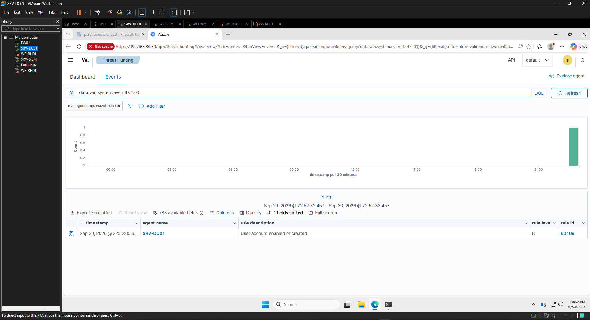

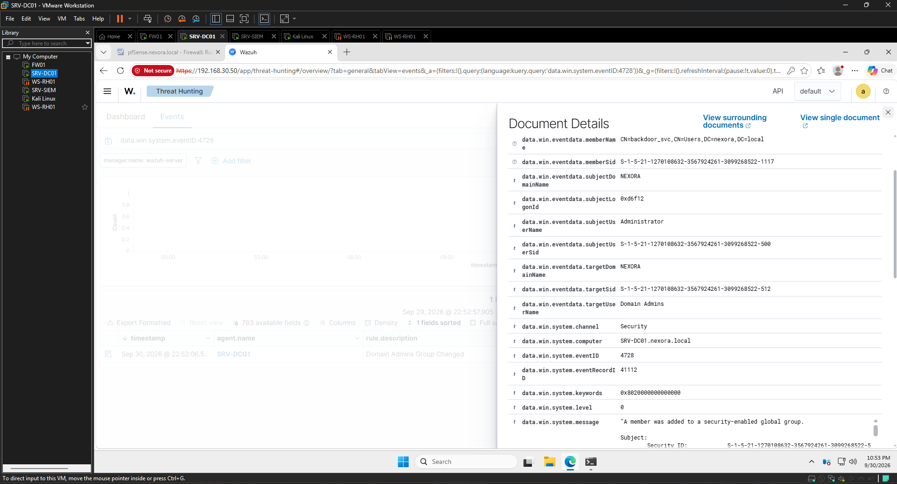

> Novo Domain Admin não planejado = bandeira vermelha nº 1 de invasão.

### Limpeza (higiene de laboratório)
O artefato foi **removido** após a evidência — o lab não fica com backdoor ativo.

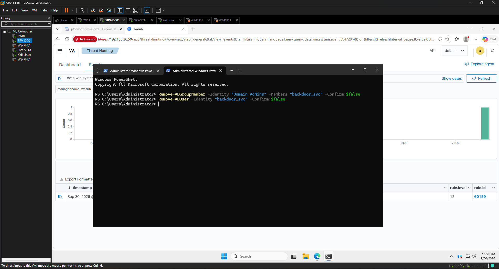

## Ataque 5 — Responder / LLMNR Poisoning → BLOQUEADO pela segmentação (T1557.001)
O Responder ficou escutando na zona ATAQUE, mas o broadcast (LLMNR/NBT-NS) do WS-RH01 **não cruza sub-redes** (pfSense). Nada capturado = defesa funcionando.

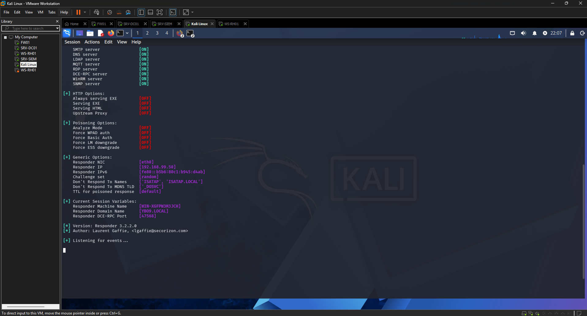

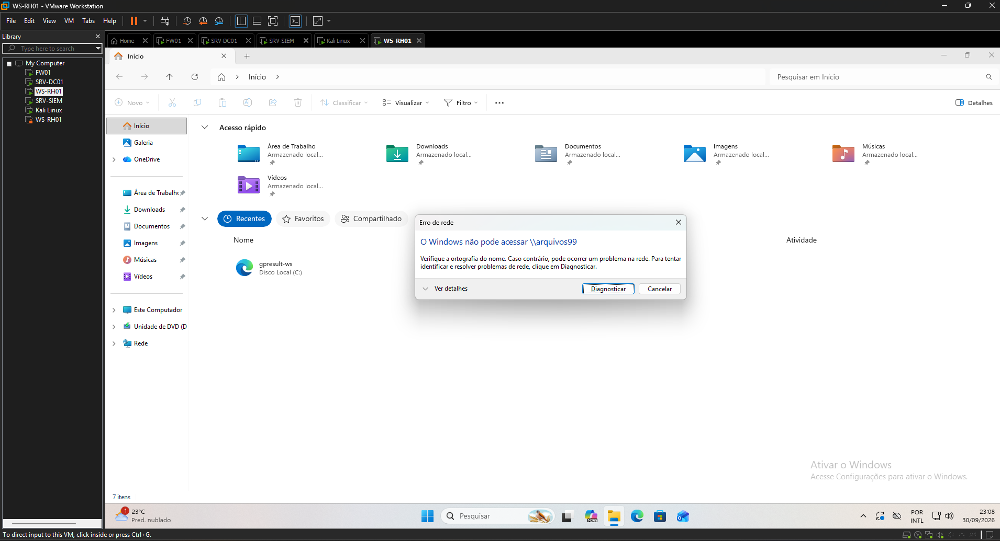

## Ataque 6 — Persistência REMOTA (wmiexec) → DETECTADA + BLOQUEADA (T1136/T1021/T1047)
Autenticou como DA (`Pwn3d!`), **mas**: (a) o **Wazuh detectou** o logon remoto NTLM — rule **92652** "possible pass-the-hash" — e (b) o **Windows Defender** barrou a criação do backdoor (netexec: *"may have been detected by AV"*).

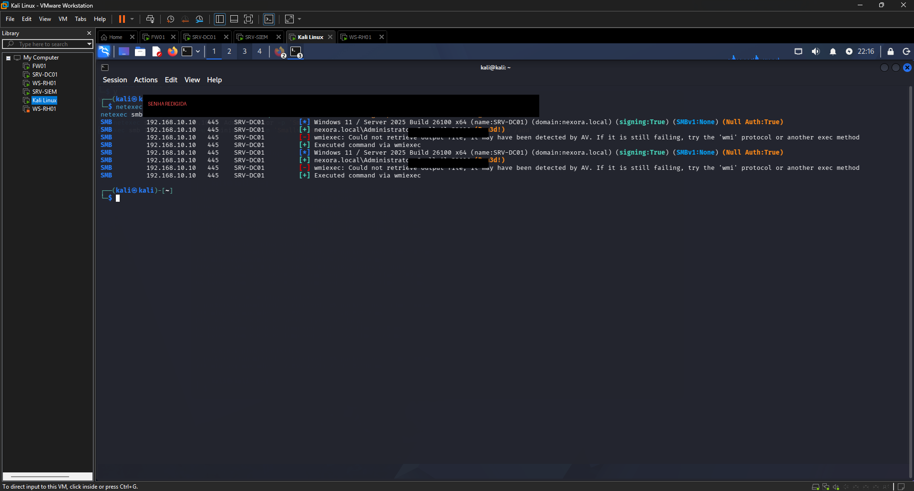

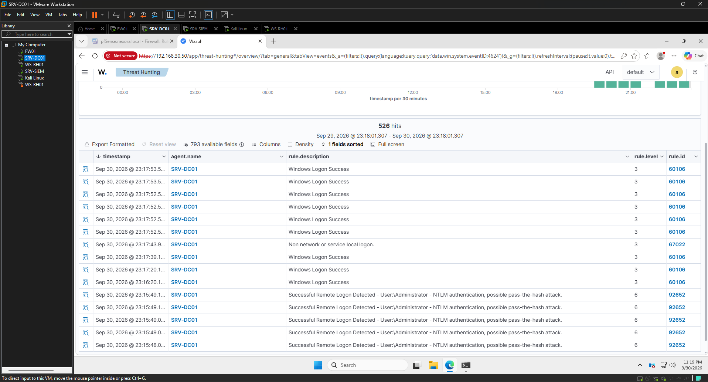

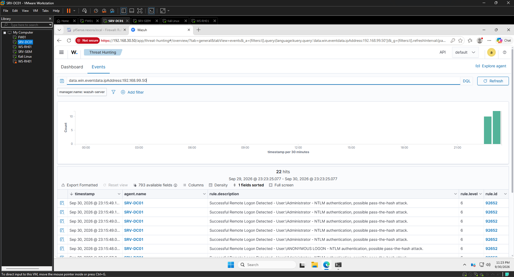

> **Caça por IP de origem:** filtrando `data.win.eventdata.ipAddress:192.168.99.50` isolei **só** o que veio da Kali — é assim que um analista separa o atacante do ruído normal da rede.

---

**Competências demonstradas:** Kali (nmap, netexec, Responder), simulação de ataques (recon, brute force, spraying, persistência local e remota, LLMNR poisoning), caça a ameaças e triagem no Wazuh, leitura de Event IDs e do **IP de origem** (`data.win.eventdata.ipAddress` ≠ `agent.ip`), mapeamento MITRE ATT&CK e **defesa em profundidade** (detecção + prevenção em 3 camadas).
