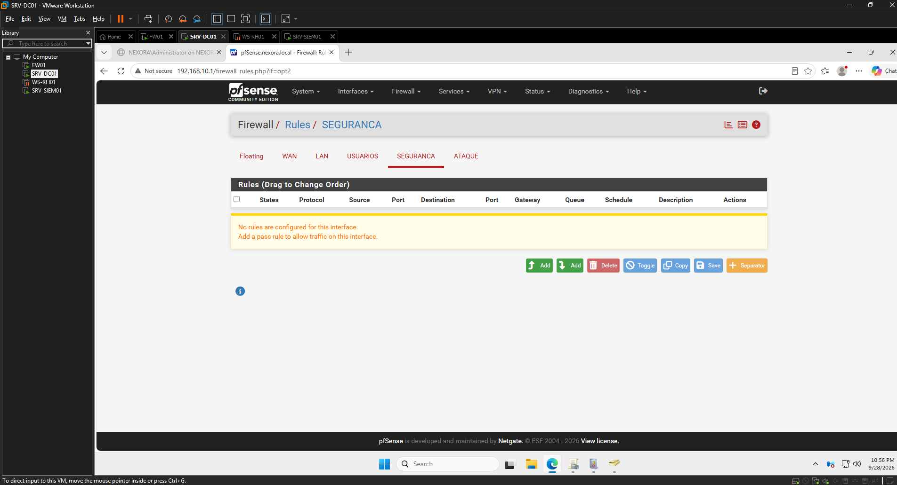
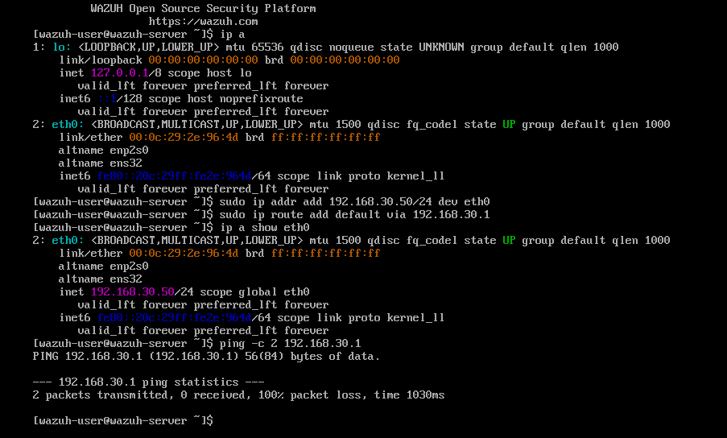
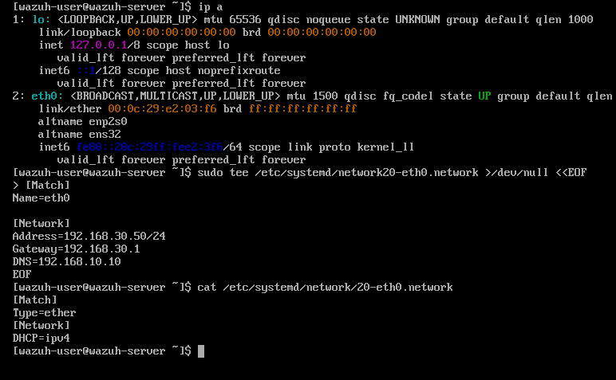

# 07 — Troubleshooting & Lições Aprendidas

> O registro mais útil do repositório para entrevista: cada problema real do laboratório no formato **Sintoma → Investigação → Causa raiz → Correção → Lição**, com a evidência ao lado. Diagnosticar por camadas e saber explicar o "porquê" é o trabalho central de infra/SOC.

---

## TS-01 — SIEM com IP correto, mas ping no gateway com 100% de perda
- **Sintoma:** `inet 192.168.30.50` na `eth0`, mas `ping 192.168.30.1` com 100% de perda.
- **Investigação:** IP local OK → isolei camada 2 (VMnet) e camada 3 (pfSense). No pfSense, a aba **SEGURANCA** (interface OPT) mostrava *"No rules are configured for this interface"*.
- **Causa raiz:** interface **OPT nova sem regra** → o pfSense aplica *default-deny*, bloqueando inclusive o ping ao próprio gateway.
- **Correção:** regra **Pass** (SEGURANCA net → any, temporária/lab).
- **Lição:** no pfSense, **cada interface OPT nasce bloqueando tudo** (diferente da LAN). "Sem conectividade" numa zona nova é quase sempre **falta de regra**. *(default-deny, OPT interface)*

---

## TS-02 — IP estático do SIEM não persistia após reboot
- **Sintoma:** após reboot, a `eth0` voltava sem IPv4; `networkctl status eth0` mostrava `Network File: n/a` e estado `unmanaged`.
- **Investigação:** `cat` do arquivo revelou dois erros — a seção `[Match]` com `Name:eth0` (dois-pontos no lugar de `=`) e a chave `Adress` (com um "d"). Além disso, uma tentativa anterior gravou no **caminho errado** (`/etc/systemd/network20-eth0.network`, faltando a `/`).
- **Causa raiz:** `[Match]` inválido → o networkd não casava a interface (unmanaged); chave `Adress` ignorada em silêncio.
- **Correção:** arquivo correto em `/etc/systemd/network/20-eth0.network` (`[Match] Name=eth0`, `[Network] Address=192.168.30.50/24`, Gateway, DNS) + `networkctl reload` **antes** de `reconfigure`. Validado com reboot.
- **Lições:**
  - No systemd-networkd, `[Match]` com `:` no lugar de `=` deixa a interface **unmanaged em silêncio**.
  - Chave escrita errada é **ignorada sem erro** — valide com `networkctl status` e um teste real (reboot).
  - Depois de editar o arquivo: **`networkctl reload` antes de `reconfigure`** (senão usa config em cache).

---

## TS-03 — Perda do SIEM sem snapshot
- **Sintoma:** a VM do SIEM foi perdida por completo, sem ponto de restauração.
- **Causa raiz:** nenhum snapshot tirado depois de o SIEM ficar funcional.
- **Correção:** reconstrução do SIEM (via OVA, reaplicando as correções de boot/rede já conhecidas) e adoção de uma **política de snapshot**: tirar snapshot sempre que um serviço atingir um estado funcional.
- **Lição:** **snapshot faz parte do "pronto"** — "configurei e funcionou" sem snapshot é progresso frágil. *(backup, change management)*

---

> Cada caso aqui foi resolvido de ponta a ponta no laboratório, em ambiente isolado e autorizado.
