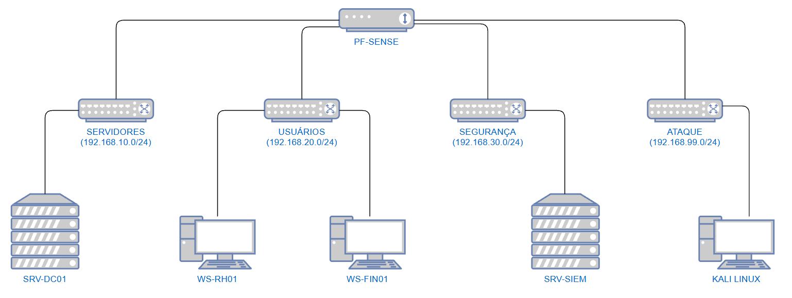
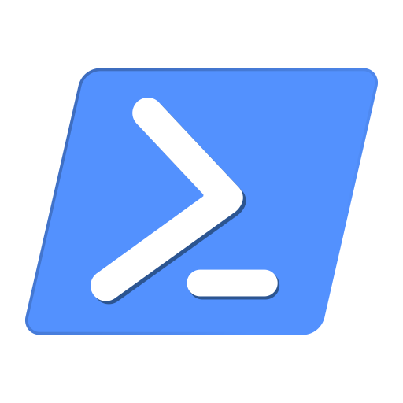

# Nexora Security Lab 🛡️

> Laboratório de segurança defensiva (Blue Team / SOC) simulando o ambiente corporativo de uma empresa fictícia, do zero: rede segmentada, Active Directory, hardening, monitoramento com SIEM, simulação de ataques e resposta a incidentes.



---

## 📖 A História (Contexto do projeto)

A **Nexora Logística Ltda** é uma empresa fictícia de logística com aproximadamente 40 funcionários. Após uma **tentativa de phishing**, a diretoria pediu à equipe de TI visibilidade de segurança: segmentação de rede, hardening do Active Directory e monitoramento centralizado capaz de detectar ataques.

Este repositório documenta a construção desse ambiente ponta a ponta — **construir → proteger → monitorar → atacar → detectar → responder** — com foco em demonstrar competências reais de um Analista de SOC / Blue Team Júnior.

> ⚠️ **Escopo e ética:** todos os ataques deste laboratório são executados exclusivamente contra máquinas do próprio ambiente, em rede isolada, sem acesso à internet a partir da zona de ataque. Nenhum sistema de terceiros é alvo.

---

## 🎯 Competências no projeto

| Área | O que este projeto prova |
|---|---|
| Redes | Segmentação em zonas, firewall (pfSense), roteamento entre redes, DHCP relay, regras de menor privilégio |
| Active Directory | Promoção de Domain Controller, estrutura de OUs, usuários/grupos, DNS, GPOs de hardening |
| Windows | Auditoria avançada, Event IDs, PowerShell, hardening de estações |
| Linux | Servidor de arquivos, coleta de logs, agente de monitoramento |
| SOC / Blue Team | SIEM (Wazuh), Sysmon, detecção de ataques, correlação de eventos, caça a ameaças |
| Resposta a incidentes | Relatórios estruturados: timeline, evidências, contenção, lições aprendidas |
| Documentação | Registro de todas as provas e passos do projeto |

---

## 🗺️ Arquitetura

Firewall **pfSense** no centro, roteando entre 4 zonas internas + WAN. Cada zona é uma rede virtual isolada no VMware.

| Zona | Sub-rede | Gateway | Hosts |
|---|---|---|---|
| WAN | DHCP (NAT VMware) | — | FW01 (saída p/ internet) |
| Servidores | 192.168.10.0/24 | .1 | SRV-DC01 (.10) |
| Usuários | 192.168.20.0/24 | .1 | WS-RH01, WS-FIN01 (via DHCP) |
| Segurança | 192.168.30.0/24 | .1 | SRV-SIEM (.50) |
| Ataque | 192.168.99.0/24 | .1 | KALI01 (.50) — **isolada, sem internet** |

---

## 🧰 Stack

`VMware Workstation` · `pfSense CE` · `Windows Server 2025` · `Windows 11` · `Ubuntu Server 24.04` · `Wazuh` · `Sysmon` · `Kali Linux` · `PowerShell`

<div align="left">
  &nbsp;&nbsp;
  &nbsp;&nbsp;
  &nbsp;&nbsp;
  &nbsp;&nbsp;
  &nbsp;&nbsp;
  &nbsp;&nbsp;
  
</div>

---

## 📂 Estrutura do repositório

```
nexora-homelab/
├── readme.md                    ← você está aqui
├── 01-arquitetura/              ← rede, IPs, diagrama, decisões de arquitetura
├── 02-active-directory/         ← passo a passo do AD + scripts PowerShell
├── 03-hardening/                ← GPOs e endurecimento
├── 04-monitoramento/            ← Wazuh, Sysmon, coleta de logs
├── 05-cenarios-ataque/          ← simulações de ataque e detecções (MITRE ATT&CK)
├── 06-relatorios-incidente/     ← relatórios por incidente
└── 07-licoes-aprendidas/        ← troubleshooting e lições aprendidas
```

---

## 👤 Autor

**Leonardo Ramalho** — Analista de TI | Cybersecurity (Blue Team / SOC).

[LinkedIn](https://www.linkedin.com/in/leonardo-ramalho-) · [GitHub](https://github.com/imleozzin)


